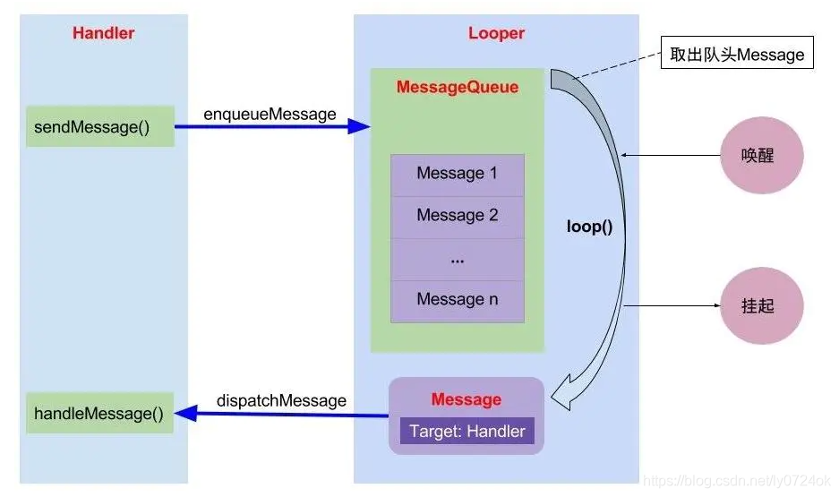

# Android util

## 1. 线程间通信Handler
Message：需要传递的消息，可以传递数据；
MessageQueue：消息队列，但是它的内部实现并不是用的队列，实际上是通过一个单链表的数据结构来维护消息列表，因为单链表在插入和删除上比较有优势。主要功能向消息池投递消息(MessageQueue.enqueueMessage)和取走消息池的消息(MessageQueue.next)；
Handler：消息辅助类，主要功能向消息池发送各种消息事件(Handler.sendMessage)和处理相应消息事件(Handler.handleMessage)；
Looper：不断循环执行(Looper.loop)，从MessageQueue中读取消息，按分发机制将消息分发给目标处理者。

原文链接：https://blog.csdn.net/ly0724ok/article/details/117324053